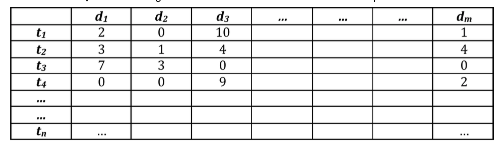
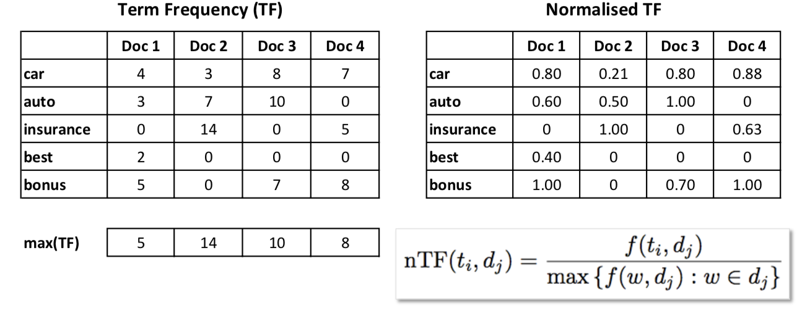
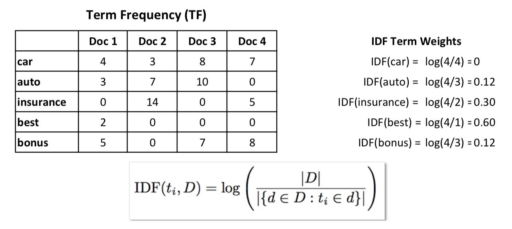
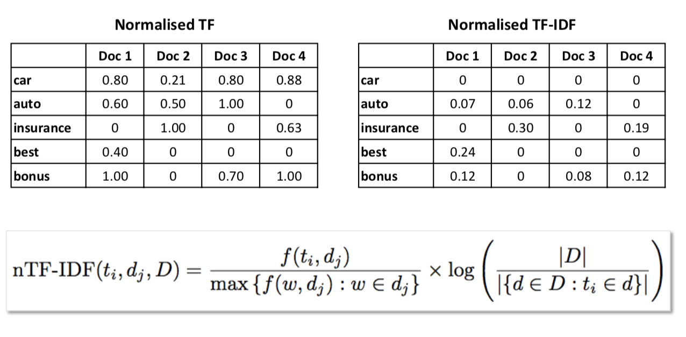
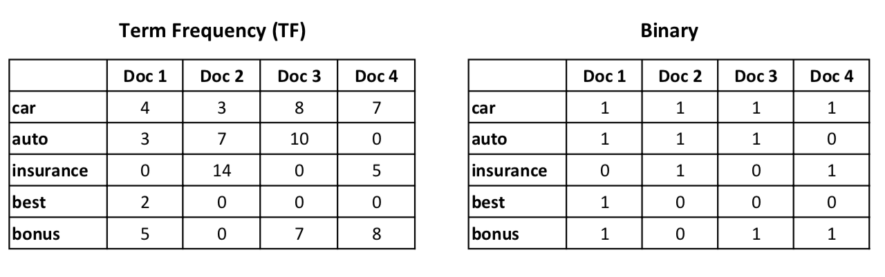

# 2. Content-Based Recommendation

***
### Overview
* Content-based recommender systems
* Supports both personalised and non-pesonalised recommendation
* Distinguish between:
	* Traditional content-based approaches (e.g. recommendating documents)
	* Case-based approaches (e.g. recommending items described by features)
* Diversity enhancing approaches 
* Evaluation methodology and metrics

***

## Content-based Recommendation

* Items are recommended which are are similar in content to previously selected items

* Recommendations are based on a description of the content of items as opposed to what people actually thought about items

* A *more-like-this* form of recommendation – e.g. recommend items that are similar to a target item (**non-personalised**) or to those that the user has consumed (purchased/visited/read etc.) in the past (**personalised**)

* Distinguish between **traditional content-based** (unstructured) and **case- based** (structured) approaches

* Key concepts: ==*item representation*== and ==*item-item similarity*==

## Traditional content-based recommendation
* Recommending news articles,webpages etc

* Generating recommendations:
	* **Non-personalised** – rank recommendation candidates by similarity to the target item
	* **Personalised** – rank recommendation candidates by similarity to the target user’s profile (e.g. items previously purchased/visited/ watched etc. by the target user)

* Items are represented by documents

* Use techniques from **Information Retrieval(IR)**:
	* **Vector Space Model (VSM)** – represent documents as vectors in the multi-
dimensional term space

* Represent items using terms contained in documents 
(unstructured representation)

* **Term-document matrix**:
	* Entries capture how frequently each term occurs in each document
		
</img>

* **Term weighting** – different approaches to weight the importance of terms in documents	
	* **Term frequency (TF)** weighting:
		* Entries in the term-document matrix capture how frequently terms appear in documents
	
</img>

	
	* **Normalised Term Frequency (nTF)** weighting
		* Expect longer documents to contain more occurrences of terms=> normalise entries e.g. by the maximum TF in a document
		
		* ==Document(i.e.column)-wise normalisation==
		
</img>

	
	* **Inverse Document Frequency (IDF)**
		* Terms that appear in many documents do not help to discriminate between documents – idea is to reduce the weights of such terms
		* ==Term (i.e. row)-wise operation==
		
</img>

		
	* **Normalised Term Frequency - Inverse Document Frequency (nTF-IDF)**
	
</img>
 
	
	* **Binary term weighting**
		* Entries capture whether or not terms appear in documents {0,1}
				
</img>

* **Term Stemming**
	* Term stemming:
		* For grammatical reasons, documents use different forms of words, such as organise, organises, and organising.
		
		* Also, there are families of related words with similar meanings, such as democracy, democratic, and democratisation.
		
		* Can consider these terms as being the same for matching purposes
		
	* Term stemming is applied to all terms prior to construction of the term-
document matrix:
		* Example: computing, computer, compute => comput
		* Can lead to incorrect matches between semantically (语义上) unrelated terms...
		* Does not deal with synonyms (e.g. car, automobile...).

* **Stop Words**
	* Stop words:
		* Common words may be of little value when discriminating documents.
		
		* For example, some frequently occurring words in the English language are: a, an, and, are, as, at, be, by, for, from...

	* Determining a stop word list
		* The general aproach is to sort all terms by *collection frequency* – i.e.
the total number of occurrences of a term in a document collection.

		* The most frequent terms (often hand-filtered for their semantic content relative to the collection domain) are added to the stop word list.
		
		* Stop words are omitted (省略) from the term-document matrix.

* **Document-document Similarity**
	* Since documents are represented as ==**term vectors**== in a multi-dimensional vector-space, document-document similarity can be computed by the cosine of the angle between their two vectors.
	
</img>

	
	* Example
	
</img>

* Making Recommendations
	* **Non-personalised** recommendations:
		* Rank recommendation candidates by similarity (i.e. using cosine similarity) to the target item
	* **Personalised** recommendations:
		* Rank recommendation candidates by similarity to the target user’s
profile
		* Various approaches depending on how the profile is constructed

* User Profiling
	* Users could create their own profiles:
	* Infer profile from user behaviour (implicit):
	* Infer profile from user ratings (explicit):
	* Combination of implicit/explicit data
	* Other approaches:
		* NLP techniques (e.g. POS tagging)
		* Document clustering
		* Topic modelling (e.g. LDA)

## Case-based Recomendation

* A particular style of content-based recommendation:
	* Items are represented in a more structured manner using a well- defined set of features and feature values
	
	* Allows for sophisticated and fine-grained judgements about the similarity between items
	
* A powerful approach to recommendation:
	* Facilitates the search and navigation of complex information spaces
	
	* Provides for flexible user-feedback options
	
	* Well-suited to e-commerce applications

* Based on ideas from the area of **Case-based Reasoning (CBR)**

### Case-based Reasoning
* Case-based recommender systems:
	* Origin in Case-based Reasoning (CBR) systems...

* CBR systems:
	* Used for problem solving & classification tasks
	
	* Rely on concrete experiences (**cases**) to solve problems
	
	* Maintain a **casebase** (database) of past problem solving experiences
	* Differ from traditional problem solving techniques, e.g. rules-based systems

* Cases are comprised of two parts：
	* **Specification/problem part:** features that describe a problem
	
	* **Solution part:** solution to specified problem

* Underlying assumptions
	* The world is a regular place and similar problems tend to have similar solutions.
	
	* The world is a repetitive place and similar problems tend to recur.
	
	* Instead of solving problems from scratch (从头做起) using first-principles methods, the solutions to previous similar problems are recalled and reused  
	
#### CBR Cycle
* Solving new problems - CBR Cycle:
	* **RETRIEVE:** The target problem description is used to retrieve a case(s) from the casebase.
	* **REUSE:** The retreived case(s) are reused (and possibly adapted) to develop a possible solution.
	* **REVISE:** The new solution is tested for success (reviewed). A human expert, for example, may revise it if necessary.
	* **RETAIN:** The target problem along with its solution is then added to the casebase (learning).

	

		