# Decision Trees

***
### Overview
* What is a Decision Tree
* Feature Selection
	* Good vs Bad features
	* Information Theory - Entropy
* How to build a Descision Tree?
	* ID3 top-down algorithm
	* Information Gain

***

* A classification model to predict class labels by learning decision rules inferred from training data.
 
</img>

* **Basic Idea:** Build a tree model that splits the training set into subsets in which all examples have the same class.
	* Splitting is done using rules inferred from the training set.
	* Each rule is based on a feature, and the split corresponds to the values it can take
	* If necessary, each subset can be split again using another feature, and so on until all examples have the same class.
	* Once the tree is built, we can use it to quickly classify new input examples - this is an eager learning strategy.

* Process
	1. Initially all examples in the training set are placed at the root node of the tree.
	
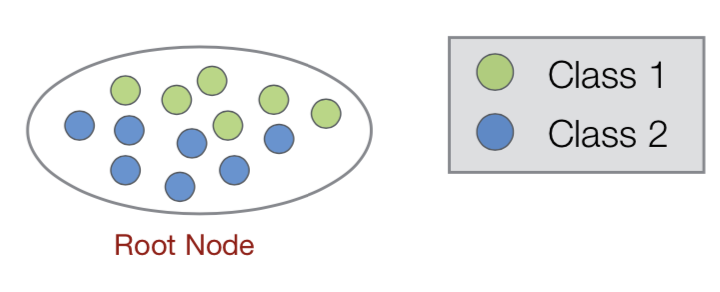</img>

	
	2. One of the available features (A) is now used to split the examples at the root node into two or more **child nodes** containing subsets of examples.
	
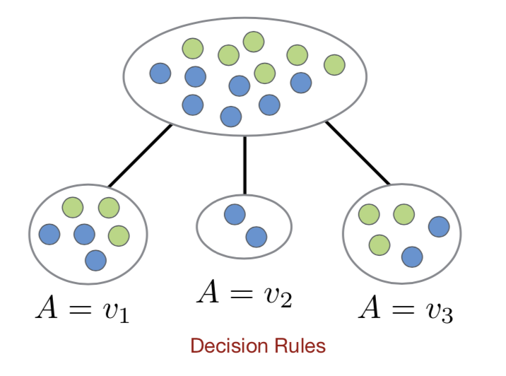</img>

	
	3. The same process is now applied to each child node, except for any child node at which all examples have the same class.
	
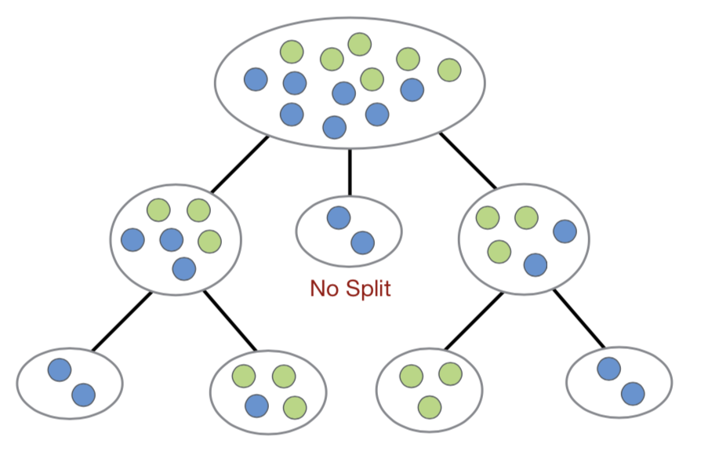</img>

	4. This continues until the training set has been divided into subsets in which all the examples have the same class.
	
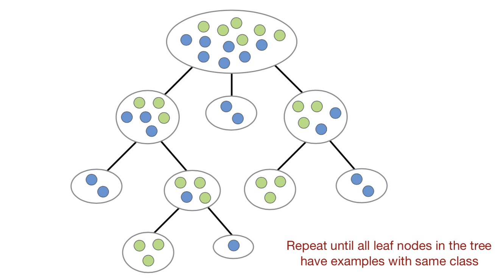</img>

	
* Node Purity
	* A tree node is **pure** if all examples at that node have the same class label.
	
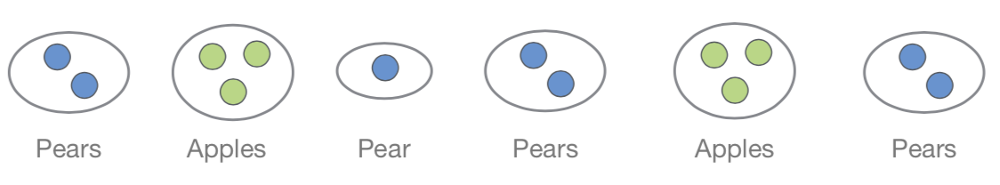</img>

	
	* A decision tree in which all the leaf nodes are pure can always be constructed provided there are **no clashes** in the data.
	
	* Most decision tree algorithms use some measure of node (im)purity to choose features to split when building the tree. This measure guides the learning process.

* Objective
	* A **“good”** decision tree will classify all examples correctly using as few tree nodes as possible.
	
	* Objective in building a decision tree is to choose good features so as to minimise the depth of the tree.

	
* Good vs Bad Features
	* **Good Features:** A perfect feature divides examples into categories of one class ⇒ high purity
	
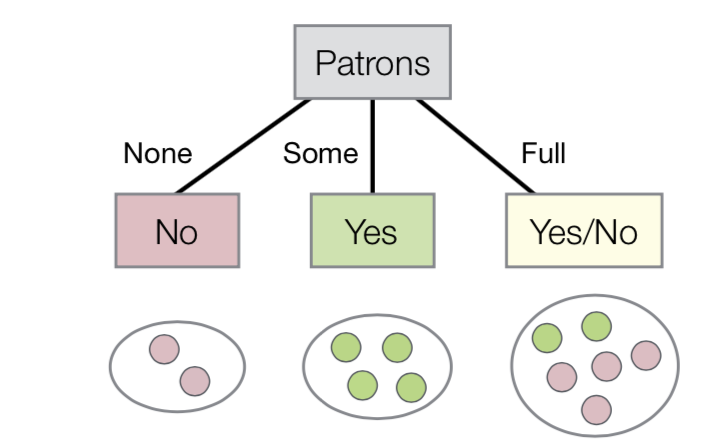</img>

	* **Bad Features:** A poor choice of feature produces categories of mixed classes ⇒ high impurity

	
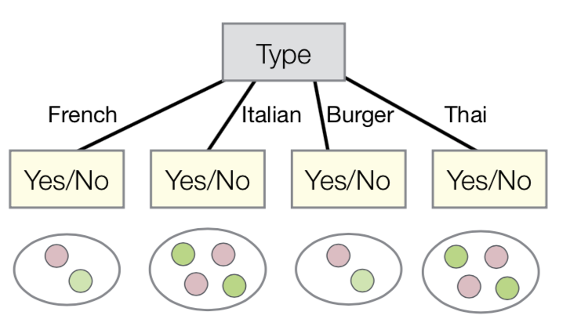</img>

	
* Feature Selection
	* **Goal:** Find good features which divide examples into categories of a single class
	
	*  Feature selection algorithms have been developed which use impurity as an objective to guide feature selection 
 (e.g. Entropy, Gini impurity).
 
	* **Common selection strategy in decision trees:**
		* For each feature, some measure of impurity is applied to the current set of tree nodes.
		* The feature that maximises **the reduction in impurity** is
selected as the next most useful feature.

* Entropy
	* **Entropy:** In information theory, a measure of uncertainty around a source of information. Low for predictable sources, higher for more random sources.

	* In the context of decision trees, entropy provides a measure of impurity - how uncertain we are about the decision for a given set of examples.
	
	 
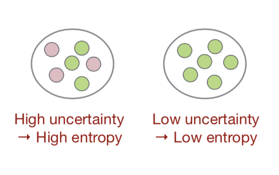</img>

	 
	* **Definition:** 
	 	* Entropy of a set of examples ***S*** with class labels {C1,...,Cn} :
	 	
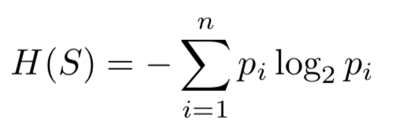</img>

	 	* where pi is the relative frequency (probability) of class Ci.
	* Examples:
		* The lowest possible entropy (i.e. zero) occurs when all examples have the same class label.
		* The highest entropy occurs when we are most uncertain.
		
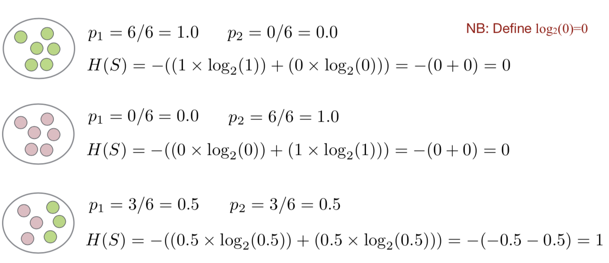</img>

* Top-Down Induction of Descision Trees
	* **ID3 Algorithm:** Popular algorithm which repeatedly builds a decision tree from the top down (Quinlan, 1986).
	* Start with an empty tree and set of all training examples S.

			ID3( S ):
				• IF all examples in S belong to the same class C THEN
					– Return new leaf node and label it with class C. 
				• ELSE
					– Select a feature A based on some
					– Generate a new tree node with A as the test feature. 
					– FOR EACH value vi of A:
						* Let Si ⇢ S contain all examples with A = vi. 
						* Build subtree by applying ID3( Si )
	

* Criterion: Information Gain
	* **Information Gain (IG):** Popular information theoretic approach for selecting features in decision trees, based on entropy.
	* Measures a feature’s overall impact on entropy when used to split a set of training examples into two or more subsets.
		* How much information do we learn by splitting on the feature?
		* How much is the reduction in entropy?
	* **Definition:**
		* IG for feature ***A*** that splits a set of examples ***S*** into {*S1,...,Sm*} :
	
</img>
 
	* Example:
		* Initial training set has 6 Yes, 6 No examples.
		* Which feature should we select to split at the root node?
		
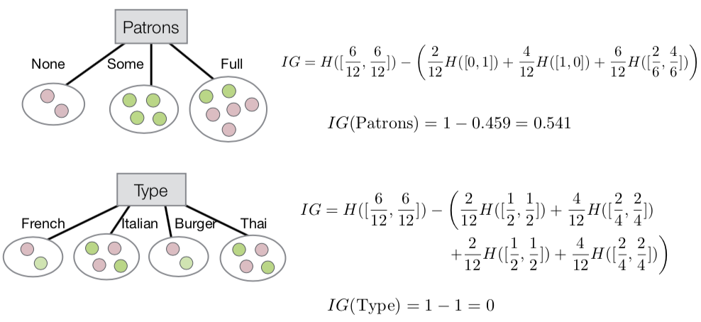</img>

		* Feature “Patrons” has higher IG, so a better choice for splitting.
		
* Handling Inconsistent Data
	* Inconsistent training data occurs when two identical examples from the training set have different labels:
	
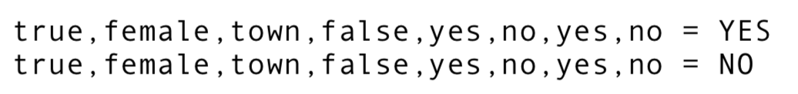</img>

	* When building a tree, this can result in cases where **leaf nodes are not “pure”** and **no features are left to split**.
	
	* Simple solution:
		* For the label, take the majority vote at the leaf node.
		* If there is a tie, randomly choose one of the class labels.
		
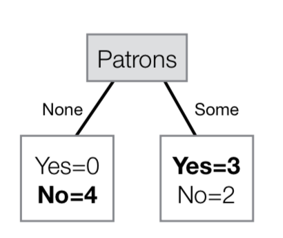</img>
