# 1. Introduction to Machine Learning

***
### Overview
* Common Applications
* Supervised vs. Unsupervised Learning
* Representing Data as Features

***

## Applications:

* Spam Classification:
	* Apply a learning algorithm to automatically classify incoming emails as *spam* or *non-spam*, based on previous examples of legitimate and spam email.

	
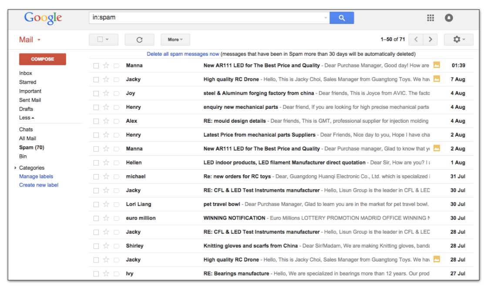</img>

* Web Search
	* Submit a query to a search engine, it finds pages relevant to the query, and returns them ranked by relevance
	
	
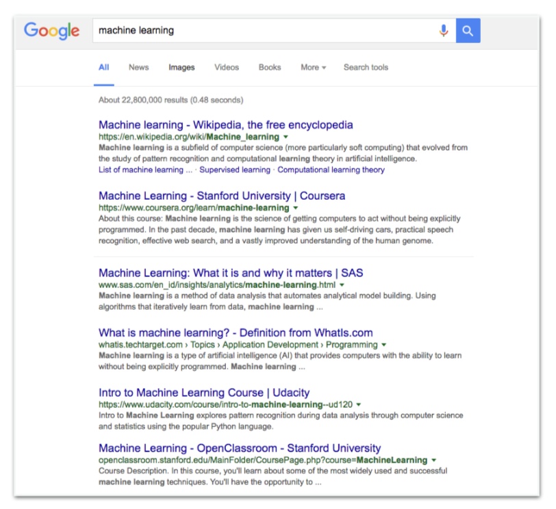</img>

	
* Movie Recommendation
	* Netflix provides personalised recommendations for movies you might like, based on the previous ratings of other users.
	
	
</img>

* Machine Translation
	* Use examples of translated documents to learn how to translate text between the two languages.
	
	
</img>

	
* Marketing
	* Automatically divide a large customer base into clusters of individuals that share similar characteristics, for target marketing.

	
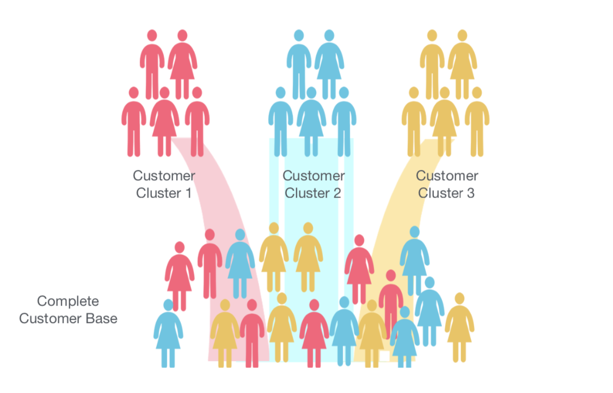</img>

	
* Medicine
	* Machine Learning provides tools and support in diagnostic and prognostic () tasks in a variety of medical domains, including:
		* Disease identification and diagnosis
		* Prediction of disease progression
		* Medical image analysis and understanding
		* Personalised medicine and behavioural modification
		* Epidemic (传染病) outbreak prediction
		
	
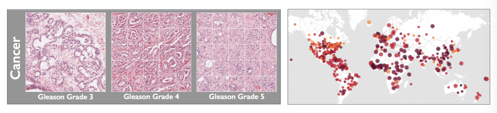</img>

	
* Chatbots
	* achine learning algorithms are now widely used in "chatbots", intelligent digital assistants designed to automatically respond to user requests via conversational interfaces
	
	
</img>

* Anomaly (异常) Detection
	* Algorithms can find patterns in data that don't conform to a model of “normal” behaviour in a system. In some systems, these are rare events. In other systems, these are unexpected bursts of activity.
	
		* Cybersecurity: Spike in number of false login attempts.
		* Payment systems: High number of failed/incomplete payments.
		* Fraud detection: Unusual patterns in financial networks.
		* Fault detection (故障检测): Timely
 detection and diagnosis of faults in aircraft.
 		* Event detection: 
 Sudden spike in volume 
 of social media posts.
 
 
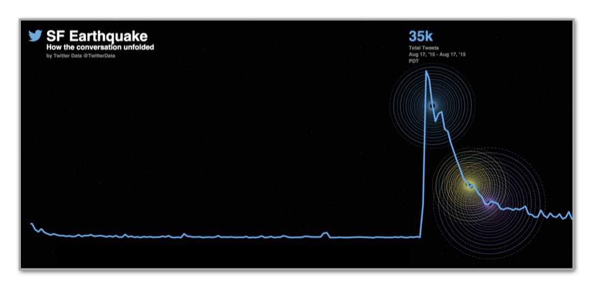</img>

 
 
* Face Recognition
 	* Facebook tags photos by comparing them to profile pictures.
 	
 	
 	
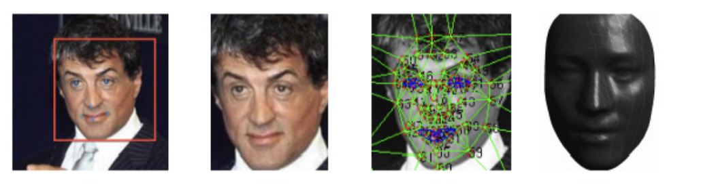</img>

 
* Autonomous Vehicles
 	* Car manufacturers and researchers are exploring the potential of self-driving cars. These involve the analysis of huge volumes of sensor data, categorised using ML approaches combined with human labelling.
 	
 	
</img>

## Supervised vs Unsupervised Learning

* **Supervised Learning:**
	* An algorithm that learns a function from examples of its inputs and outputs. It uses manually-labelled example data (i.e. a **training set**) to predict the correct answer for new unseen query inputs.
	
	* **Classification:**
		* Examples represented by a set of features, which help decide the target class to which a new query input belongs(i.e. the output is a class label).
		
		
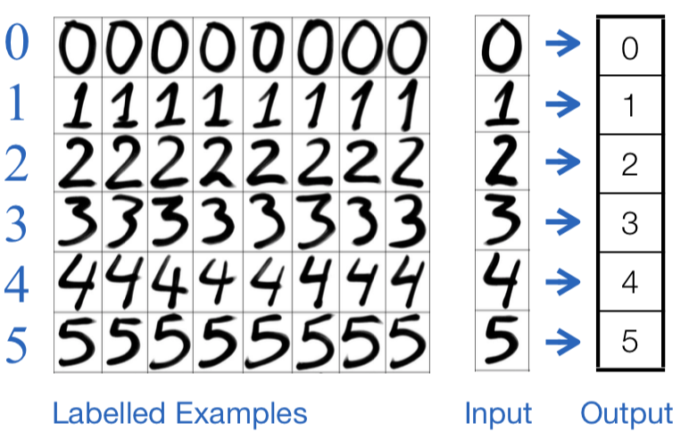</img>

	
	* **Regression:**
		* Examples characterised by a set of features, which help decide the value of a continuous output variable (i.e. the output is a number).
		
		
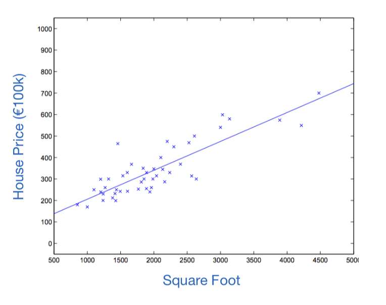</img>

		
* **Unsupervised Learning:**
	* An algorithm that finds structure in data where ==no== manually labelled examples are available as inputs - i.e. there is no training set. These algorithms are more focused on data exploration and knowledge discovery. 
	* e.g. Clustering, topic modelling algorithms

##Classification Tasks
* **Binary Classification:** Assign a new query input to one of two possible target class labels.
	
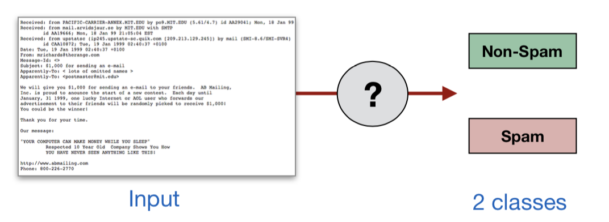</img>

	
* **Multiclass Classification:** Assign a new query input to one of 
 M > 2 different target class labels.
	
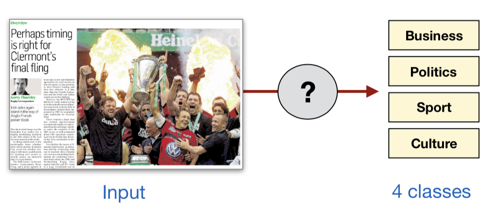</img>

 
* Representing Data
	* Commonly we use a tabular structure to represent a dataset, often referred to as the **analytics base table (ABT)**.
	
	* Each row represents a different example, and is composed of a set of **descriptive features**.
	
	* For classification, we have training data where each row also has a **target class label** - i.e. the "correct answer".
	
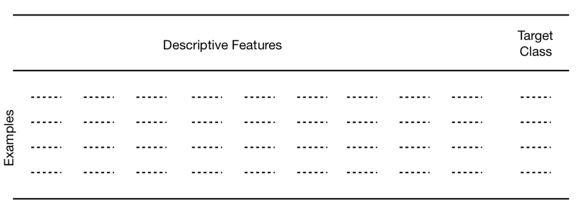</img>

	* The descriptive features used to represent examples can be distinguished by the type and number of values they can take.
		* **Binary:** Takes only two values - a boolean True/False decision
			* e.g. married={True,False}, test_result={Pass,Fail}
		
		* **Categorical (Nominal):** A feature that takes values from two or more categories, with no intrinsic ordering to the categories. 
			* e.g. blood_group={A,B,AB,O}, nationality={French,Irish,Italian}
		* **Ordinal:** Similar to a categorical variable, but there is a clear ordering of the variables.
			* e.g. grade={A,B,C,D,E,F}, dosage={Low,Medium,High}

		* **Continuous:** Numeric measurements, with or without a fixed range for the values.
			* e.g. temperature, weight, height, latitude, longitude etc.
			

* Classificaiton Algorithms
	* Many different learning algorithms exist for classification
 (e.g. k-nearest neighbour, decision tree, neural network, support vector machine).
 
 	* Problem dimensions will often determine which classification algorithm will be practically applicable, due to processing, memory, and storage constraints.
 		* Number of input examples N.
		*  Number of feature (dimensions) D representing each input example.
		* Number of target classes M.
