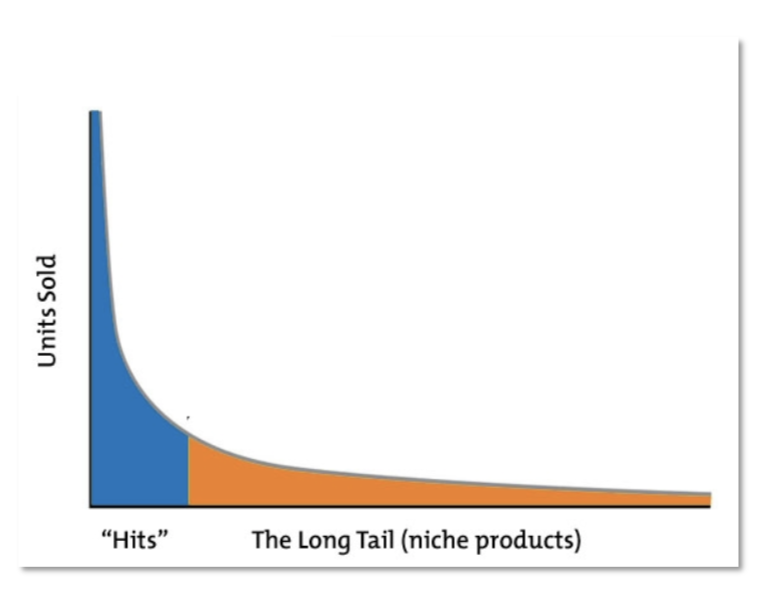
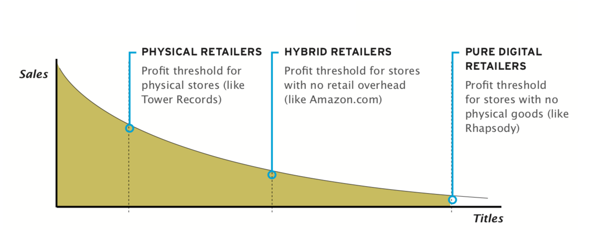

# 1. Recommender Systems Introduction

## The Long Tail

#### Traditional high street stores(闹市区的商店):
* Limited by available shelf space
* Stors have to stock popular items
* Limited choice for consumers

#### Online stores:
* Can carry much more inventory(存货) — both ==*hit*== (畅销产品) and ==*misses*== (冷门产品) than high street stores
* Not limited by space considerations and benefit form more efficient distribution channels
* Much more choice avaiable to consumers

#### Popularity no longer has a monopoly on profitability
* Selling less or more (misses) vs more of less(hits) 

</img>

#### The profit threshold
* physical retailres < hybrid retailers < pure digital retailers

</img>

## Recommender Systems (RS)
#### Recommender systems help to drive demand down the long-tail; benefits to both consumers and retailers alike

#### For Consumers:
* Many more products from which to choose
* RS enable *findability* -assist consumers to find niche products that match their personal tastes

#### For Retailers:
* Turning browsers into buyers, promoting cross-selling (交叉销售), customer loyalty
* Increased sales

#### Recommender systems now in widespread use...

### Basic Introduction of RS
- Types:
	- Personalised
	- Non-personalised
- Recommendation Approaches:
	- Collaborative （协同过滤）
	- Content-based
	- Social
	- Context-aware (情境感知)
	- Demographic (根据人口特征）
	- Hybrid
	- Group RS
	- Conversational RS
- Recommendation Knowledge:
	- User profiles (implicit/explicit preferences)
	- Product metadata
	- UGC - consumer reviews, tweets, FB posts/likes

- Recommendation Output:
	- Ranked product/item suggestions
	- Predictions for products
	- Explanations

