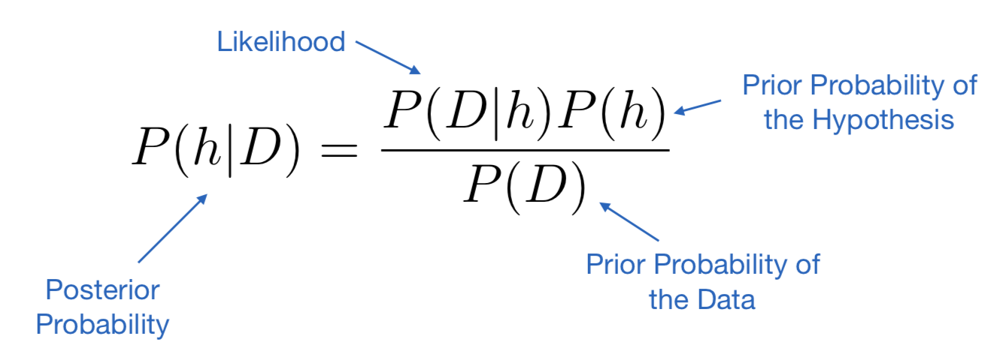
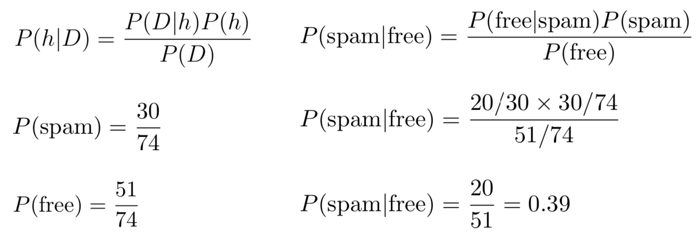
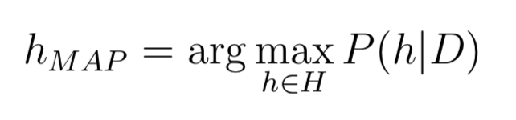
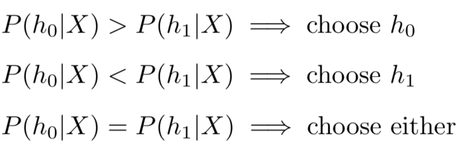
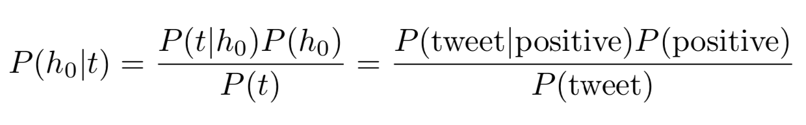
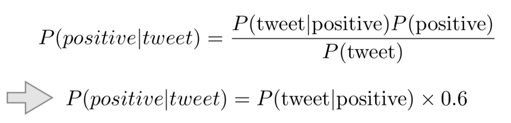
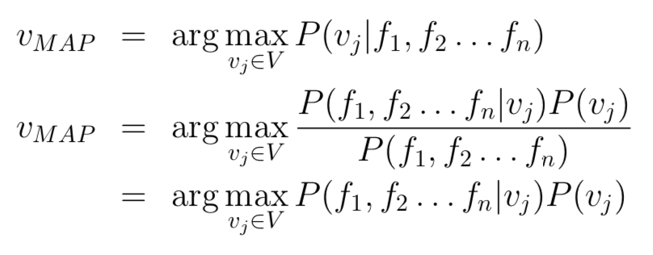

# Naïve Bayes Classifier

***
### Overview
* Probability-based Learning
* Bayes Theorem
* Naïve Bayes Classifier
* Examples & Exercises
* Numeric Features

***

* Probability-based Learning
	* **Key Idea:** Use estimates of likelihoods to determine the most likely prediction which should be made for classification 
	
	* Revise these estimates based on the data we collect.
	
	* Most common probabilistic approach for classification is the **Naïve Bayes classifier**, an eager learning approach based on **Bayes Theorem**.
		* **Why use a Naïve Bayes classifier?**
		* Intuitive and easy to implement.
		* Fast to train and to use as a classifier.
		* Suitable for moderate or large data sets with many features.
		* Can deal with missing features.

* Probability Theory
		
		P(X) Probability of event X happening.
		P(X|Y) Conditional probability of event X happening, given that event Y has happened.

	* What is the probability of a given hypothesiss ***h*** being true (“the event”), given the observed data ***D*** (“the evidence”)?
		* *P(D)*：Probability of the data D.
		* *P(h)*：Probability of the hypothesis h.
		* *P(h|D)*: Probability of the hypothesis h given the data D.
	
* Bayes Theorem
> “The probability that an event has happened given a set of evidence for it is equal to the probability of the evidence being caused by the
 event by the probability of the event itself.”
 
 * **Bayes Theorem:** Rule states that for each possible hypothesis h
 	
</img>

	* Example:
		* In the training set for a spam email filtering system:
			* 30 out of 74 emails are marked as spam
			* 51 emails of those 74 contain the word "free"
			* 20 emails containing the word "free" are marked as spam
		* Is a new email spam, given that it contains the word "free"?
		
</img>

		
* Bayes Classification
	* In classification, the **posterior probability** (后验概率) can be interpreted as:
“What is the probability that a particular example x belongs to
class *A*, given its observed feature values?”

	* For classification, each *h* corresponds to a possible class label. 
	
	* The **prior probabilities** (先验概率) *P(h)*, also called **class priors**, describe the
probability of encountering a particular class

	* If we knew *P(h|D)* we could classify the data perfectly.
	
	* Since we generally do not know *P(h|D)*, we try to estimate it from the training data using Bayes Theorem.

* Bayes Classification
	* We usually want to find the most likely hypothesis for our data.
	* Formally, we are looking for the **Maximum Aposteriori (归纳的) Hypothesis (MAP):**
	
</img>

	* Two competing hypotheses *h0* and *h1* for dataset *X*
	
</img>

	
	* In classification, we want to find the most likely class label for a given example among all possible class labels
	
	* Example: **Task:** Classify sentiment of tweets as “positive” or “negative”.
		* *P(h0)* : Probability of any tweet being classed “positive”.
		* *P(h1)* : Probability of any tweet being classed “negative”.
		* *P(h0* |*t)* : Probability of a positive class prediction for the tweet t. This is our target result.
		* *P(t* |*h0)* : Probability of the tweet *t*, given that is is positive. Calculated based on the data.
	
</img>

		* Let’s say that we know a-priori 60% of all tweets are positive and 40% of tweets are negative. => *P (positive)* = 0.6 
		* In addition, the probability of a tweet *t* is constant, so we can remove the denominator from the calculation.
		
</img>

		* But we still need some way of calculating the probability of a particular tweet (as described by its features), given the assumption that it has the class label “positive"

* Bayes Classifier
	* **Classifier Inputs:**
		* A set of labels *V = {v1, v2,...}*
		* A set of examples *X = {x1, x2,...}*, each represented by features *{f1, f2,..., fn}*
	* **Classifer Objective:**
		* Find the most probable class label *v* for *x* according to:
		
</img>

	* **Problem:** Difficult to estimate *P(f1, f2,..., fn* |*vj )*
	
	* **Key Idea:** Apply Bayes Theorem with the **“naïve”** assumption that all features in the data are **conditionally independent**:
	