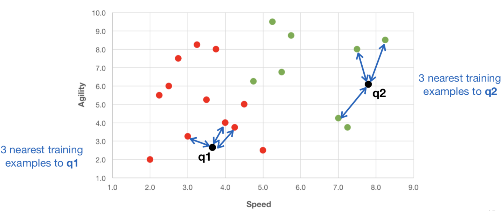

# Nearest Neighbour Classifiers

***
### Overview
* Eager v Lazy Classification Strategies
* Distance-based Models
* Feature Spaces
* Feature Spaces
* Data Normalisation
* Nearest Neighbours
* k-Nearest Neighbour Classifier (kNN)
* Weighted kNN
* kNN in Weka

***

* **Eager vs Lazy Classifiers**

	* **Eager Learning Classification Strategy**
		* Classifier builds a full model during an initial training phase, to
use later when new query examples arrive.
		* More offline setup work, less work at run-time.
		* Generalise before seeing the query example

	* **Lazy Learning Classification Strategy**
		* Classifier keeps all the training examples for later use.
		* Little work is done offline, wait for new query examples.
		* Focus on the local space around the examples.

* **Distance-based Models:**  Many learning algorithms are based on generalising from training data to unseen data by exploiting the distances (or similarities) between the two.

* Example of classification problem: Athlete Selection
	* **Training set** of performance ratings for 20 college athletes, where each athlete is described by 2 continuous features: speed, agility.
	
	* Each athlete has a **target class label** indicating whether they were selected for the university athletics team: 'Yes' or 'No'.

	
</img>

	
* **Feature Spaces**
	* We can use the feature values to visually position the 20 athletes in a 2-dimensional coordinate space (i.e. agility versus speed):
	
	
</img>

	
	* A **feature space** is a **D-dimensional coordinate space** used to represent the input examples for a given problem, with one coordinate for each descriptive feature.

* **Measuring Distance**
	* **Distance function:** A suitable function to measure how distant (or similar) two input examples are from one another are in some D-dimensional feature space.
	
	* **Local distance function:** Measure the 
 distance between two examples based 
 on a single feature.
 	* **Global distance function:** Measure the distance between two examples based on the combination of the local distances across **all features**.
 	* **Overlap function:** Simplest local distance measure. Returns 0 if the two values for a feature are equal and 1 otherwise. Generally suitable for **categorical data**.
 		
 	
</img>

 	
 	
</img>

 	* **Hamming distance:** Global distance function which is the sum of the overlap differences across all features - i.e. number of features on which two examples disagree.
 	
 	
</img>

 
 	* **Absolute difference:** For numeric data, we can calculate absolute value of the difference between values for a feature.
 	 
</img>

 	 
</img>

 		* Again we can compute a global distance between two examples by summing the local distances over all features.
 		
</img>

 		* For ordinal features, calculate the absolute value of the difference between the two positions in the ordered list of possible values.
 		
</img>

 	
 	* ==**Euclidean distance:**== Most common measure used to quantify distance between two examples with numeric features.
 		* Given by the "straight line" distance between two points in a Euclidean coordinate space - e.g. a feature space.
 		* Calculated as the square root of sum of squared differences for each feature f representing a pair of examples.
 		* The output is a real value ≥ 0, where a larger value indicates two examples are more distant (i.e. less similar to one another).
 		
</img>

 		* Example
 		 
</img>

 		 
</img>

 	
 	* Heterogeneous (组合的) Distance Functions
 		* In many datasets, the features associated with examples will have different types (e.g. continuous, categorical, ordinal etc).
 		* We can create a global measure from different local distance functions, using an appropriate function for each feature.
 		* Often domain expertise is required to choose an appropriate distance function for a particular dataset.
 		 
</img>

 		 
* **Data Normalisation**
	* Numeric features often have different ranges, which can skew certain distance functions.
	* So that all features have similar range, we apply feature normalisation.
	* **Min-max normalisation:** Use min and max values for a given feature to rescale to the range [0,1]
	
</img>

* **Nearest Neighbour Classifier**
	 * **Lazy learning approach:** Do not build a model for the data. Identify most similar previous example(s) from the training set for which a label has already been assigned, using some distance function.
	 * ==**Nearest neighbour rule (1NN):**== For a new query input q, find a single labelled example x closest to q, and assign q the same label as x. 
	 
	
</img>

	
* **k-Nearest Neighbour Classifier**
	* ==**k-Nearest neighbours (kNN):**== The NN approach naturally generalises to the case where we use k nearest neighbours from the training set to assign a label to a new query input.
	* **Example:** For new query inputs, calculate distance to all training examples. Find k=3 nearest examples (i.e. with smallest distances).
			
	
</img>

	
	* **Majority voting:** The decision on a label for a new query example is decided based on the “votes” of its k nearest neighbours. The label for the query is the majority label of its neighbours.
	
</img>

	
		* In the cases that votes are equal, break the ties at random, or based on the sum of  neighbour distances

* **Weighted kNN**
	* **Weighted voting:** In this approach, some training examples have a higher weight than others.
	* Instead of using a binary vote of 1 for each nearest neighbour, typically closer neighbours get higher votes when deciding on the predicted label for a query example.
	* **Inverse distance-weighted voting:** Simplest strategy is to take a neighbour’s vote to be the inverse of their distance from the query
 (i.e. 1/Distance). We then sum over the weights for each class.
  
 	
</img>

 	
* Noisy Data
	* A simple 1-NN classifier is easy to implement. But it will be susceptible to “noise” in the data.
	* Using a larger neighbourhood size (e.g. k > 2) can sometimes make the classifier more robust and overcome this problem.
	* But when k is large (k→N) and classes are unbalanced, we always predict the majority class.
	
	
</img>
