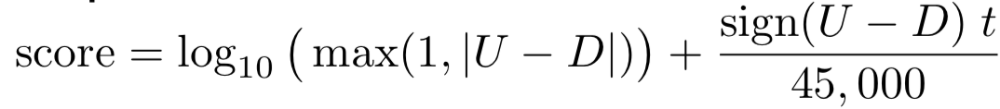

# 2. Non-Personalised Recommendation

## Redictions & Recommendations

### Distinguish Between Predictions and Recommendations

#### Predictions:
* Determine whether a user will like a give item

#### Recommendations:
* Identify items that a user kiles, typically presented in the form of a top-N ranked list

#### Predictions and recommendations are often presented together

## Non-Personalised Recommendation
### Main Approaches:

#### 1. Aggregated opinion recommenders:
* Based on user preference data

#### 2. Product association recommenders
* Based on relations between items

#### 3. Content-based recommenders
* Based on description of items

### Aggregated Opinion Recommenders
* How can preference data be obtained?
* Data can be collected *explicitly* or *implictily*

#### Explicit Ratings
 * User provide ratings - less noisy method of gathering preference data
 * A cost is associated with the provision of ratings - users need to be convinced there is a benefit in order ot make the effort
 * Examples:
 	* Numerical ratings: e.g. 1~5 stars
 	* Ordinal ratings: e.g. strongly agree, agree, neutral, disagree, strongly disagree
 	* Binary ratings: e.g. agree or disagree
 	* Unary (一元的) ratings: e.g. like
 * Ratings can be provided at the time of consumption, from memory (after the experience), or from expectation (the item has not yet been experienced)
 * ==Issues==: reliability, preferences changing with time, malicious ratings

### Implicit Data
* Not obtained directly from user; instead, ratings are “inferred (推测的)” from user behaviour/activity
* Examples:
	* Browsing patterns,links followed/not followed 
	* TV shows watched, music listened to,etc
	* Often in the form of unary data(other types possible)
* Removes cost of explicitly gathering ratings
* Every user interaction can potentially contribute
* Implicit data – available in quantity but noisy

## Making Predictions
Some (simple) approaches:

* 5 star rating scales 
	- compute mean rating or percentage of ratings ≥ 4;

	
</img>

* Binary rating scales 
	- percentage of upvotes: 
	- No indication of item popularlty  
	- Shows controversy

</img>

* Number of likes:
	- Provides an indication of popularity
	- The number of down votes received are not shown – removes controversy but important information is missing
	

</img>

* Display full distribution of ratings to users: 
	- Complex

</img>

### Average Ratings
#### Consider 5 star rating scales:
* Need to consider distribution of ratings
* Many users provide ratings – diverse
Datasets
tastes, averages move toward the centre
* Does not provide an indication of
popularity – e.g. a book which has
  received one 5 star rating (average gives
max rating!)
* Selection bias – e.g. people usually do not watch movies they think they will not like.

## Recommendations and Ranking
* What items should be placed at the top of a list?
	* Relevance to users is key 
	* Conservative (obvious, generic?) vs. high-risk/reward (interesting, novel?) recommendations
	* Base ranking on predictions?
* Considerations:
	* Business imperatives (业务需要) – e.g.promoting items
	* Domain – e.g. temporal considerations, older items may no longer be relevant (e.g. news articles)
	* Popular, new, hot, rising, controversial items – influenceon ranking?

### Examples
* **WRONG SOLUTION #1:** Score = (# positive ratings) – (# negative ratings)
	* **item 1** – 600 positive ratings and 400 negative ratings: 60% +
	* **item 2** – 5,500 positive ratings and 4,500 negative ratings: 55% +
	* **Ranking:** item 2 (score = 1000, but only 55% +) ranked above item 1 (score = 200, and 60% +)

* **WRONG SOLUTION #2:** Score = (# positive ratings) / (total # ratings)
	*  **item 1** – 2 positive ratings and 0 negative ratings
	*  **item 2** – 100 positive ratings and 1 negative rating
	*  **Ranking:** item 1 (very few positive ratings) ranked above item 2 (many positive ratings)

* **BETTER SOLUTION:**
	* Score = lower bound of **Wilson score confidence interval**（威尔逊置信区间） for a **Bernoulli
parameter** (伯努利参数).
	* Balances the proportion of positive ratings with the uncertainty of a small number of observations
	* Confidence intervals – given the ratings I have, what is the 95% chance that the fraction of positive ratings is at least X?
	* See: [How Not to Sort by Average Rating](http://www.evanmiller.org/how-not-to-sort-by-average-rating.html) to 

	
### Hacker News Ranking
* Hacker Rews articles – temporal considerations important in this domain
* Different variations reported, here is one algorithm:
* score = (U-D-1)/(T+2)^G
* where
	* U = # up votes, D = # down votes (–1 is to negate submitters vote) 
	* T = time since submission (in hours)
	* G = gravity
* Gravity and time have a significant impact on scores:
	* Generally, the score decreases as T increases, so older items are penalised
	* The score decreases much faster for older items if gravity is increased

</img>

</img>

* As the figure above
	* Scores decrease significantly with time – day old items have a very low score, even those with a relatively high proportion of up votes...
	* Scores decrease much faster at larger values of gravity.

### Reddit News Ranking

</img>

* Where:
	* U = # up votes, D = # down votes
	* t = difference between post time and Reddit epoch
* The algorithm will rank newer stories above older
* Log applied to decrease contribution of later votes
* Articles with more down than up votes are rarely surfaced

### Product Association Recommendation
* Context in recommender systems is important in a number of respects (location, time, current activity, intent, domain)...
	* Not captured by ranking recommendations on simple average ratings 

* Example: I have just bought a printer:
	* I do not want a recommendation for another printer (content-based?) nor a recommendation for the currently top-selling phone!
	* A good recommendation is this instance might be paper or ink cartridges
	* context in this sense is what are the other products that are most commonly associated (e.g. puchased together) with the current product
	* example:
	
</img>

#### People who like X also like Y
* Association rule mining – discovering interesting (non random) relations between items

* For example, consider supermarket transaction data:
	* {teapot,tea},{eggs,bacon},{apples,oranges,milk}
	
* A rule is defined as an implication of the form: X => Y
	* where X(antecedent) and Y(consequent) are item sets (may
contain more than one item)

*  Example rules:
	*  {bread,butter} => {milk}
	*  {eggs} => {bacon} (does this imply {bacon}=> {eggs}?)

* Require large transaction datasets to discover interesting rules

***

* Support:
	* supp(X) = percentage of transactions which contain X

* Confidence:
	* Does liking X imply liking Y?
	* conf(X => Y) = supp(X and Y) / supp(X) &nbsp;&nbsp;&nbsp; **(1)**

* Sufficient
	* What if Y is frequently purchased and has no relation to X?
	* May be more people like Y when X is not liked
	* Compute: supp(!X and Y) / supp(!X) &nbsp;&nbsp;&nbsp;&nbsp;&nbsp;&nbsp;&nbsp;&nbsp;&nbsp;**(2)**
	* Divide **(1)** by **(2)** to give the increase in liking Y if X is liked

***

* Alternatives to support and confidence:
	*  Lift, confidence, coverage, conviction...

* Apriori algorithm:
	* Widely used approach for frequent item set mining

* Other domains:
	* Movies, books, hotel rooms, etc. – people do not watch a number of movies
at the same time! What is the dataset (i.e. “baskets of items”)?
	* Consider items in user profiles
	* Can take temporal considerations into account (e.g. out of season vegetables)

### Summary
* Predictions:
	* Determine whether a user will like a given item
	* Non-personalised averages – useful but care needs to be taken when aggregating ratings

* Recommendations:
	* Identify items that a user likes, typically presented in the form of a top-N
ranked list
	* Many ad-hoc(专门) approaches – domain dependant, tuning of parameters required
	* Approaches to deal with temporal considerations, smoothing
	* Statistical approaches – confidence intervals
	* Product association recommenders provide (co-occurrence) context, useful in certain situations